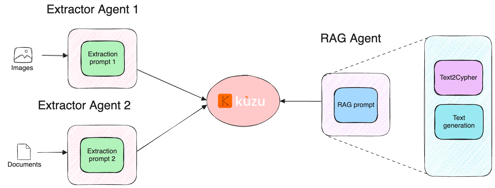
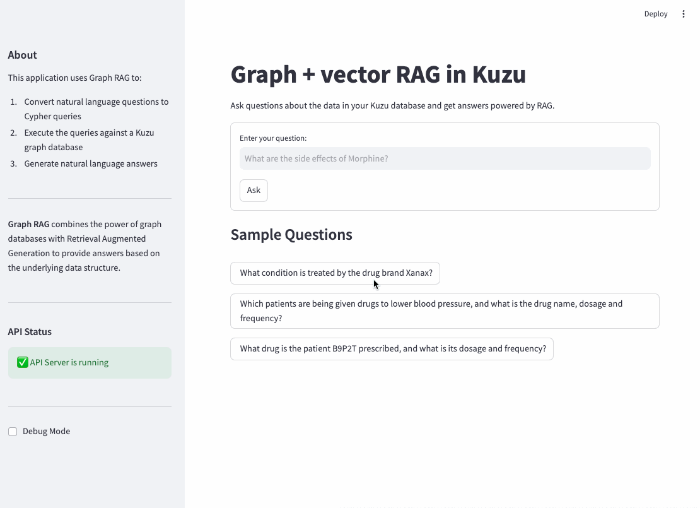

# Graph extraction and Graph RAG with BAML and Kuzu

This repository contains a demonstration of transforming unstructured data from clinical notes
and drug side effects into a knowledge graph in Kuzu. The graph is then used to answer questions
about the data using a Graph RAG pipeline.

Tools used
- [BAML](https://github.com/boundaryml/baml): AI and LLM prompting framework
- [Kuzu](https://github.com/kuzudb/kuzu): Embedded, fast, scalable graph database
- [Streamlit](https://github.com/streamlit/streamlit): Visualization framework for building custom web apps

## Overview

The goal is to show how to build modular "agents" (i.e., prompt pipelines that accomplish a
subtask) that can then be strung together to accomplish more complex tasks. BAML allows users
to compose together these kinds of agents with testing and validation capabilities, by offering
a reliable means to generate structured outputs from LLMs.

Kuzu is used as a data store for the graph, and Streamlit is used to build a simple UI for
interacting with the graph.

The general components of the pipeline are shown in the diagram below.



## Setup

Ensure you have Python 3.11+ installed.

1. Clone this repository
2. Install the required dependencies:
   ```bash
   # Install the uv package manager
   curl -fsSL https://get.uvm.dev | bash
   # Install the dependencies
   uv sync
   ```
3. Activate the environment and generate the BAML client files
```bash
cd
source .venv/bin/activate
baml-cli generate
```
This will generate the BAML client files in the `src/baml_client` directory.

## Extract data from images and text

To extract data from images and text, run the following command:

```bash
cd src
# Extract data from images that represent tables from the PDF of drugs and side effects
uv run image_extractor.py
# Extract data from the text of clinical notes
uv run notes_extractor.py
```

This will output JSON files into the `../data/extracted_data` directory.

## Creating the graph

To create the graph in Kuzu, run the following command:

```bash
uv run src/01_create_drug_graph.py
```

This will persist the Kuzu graph locally in the `ex_kuzu_db` directory.

To add the patient data to the graph, run the following command:

```bash
uv run src/02_create_patient_graph.py
```
This will augment the pre-existing graph (from the prior step) with the data from the
patient notes.

### (Optional): Create vector index

To help with vector-assisted graph traversal, we can also create a vector index in Kuzu (requires `kuzu>=0.10.0`)!
The script `03_create_vector_index.py` does the following:

- Create a vector index on the `Condition` node table to perform fuzzy search on conditions treated by drugs
- Create another vector index on the `Symptom` node table to perform fuzzy search on symptom or side effects caused by a drug.

```bash
uv run src/03_create_vector_index.py
```

---

## Evaluation

### 1. Graph construction

The main motivation for this project was to evaluate the performance of BAML and the given
LLM for the task of extracting data from unstructured text. For the graph construction task,
we have two main stages to evaluate:

1. Extracting drugs and side effects from a table in a PDF
2. Extracting medications and side effects from clinical notes

To evaluate the performance of the image extractor, run the following command:

```bash
cd evals
uv run image_extractor_eval.py
```

| Model | Date[^3] | Exact Match | Mismatch | Missing | Potential<br> Hallucination | Cost | Cost<br> factor |
| --- | --- | :---: | :---: | :---: | :---: | ---: | ---: |
| `openai/gpt-4o-mini` | Mar 2025 | 170 | 0 | 2 | 2 | 0.0008 | 1.0 |
| `openai/gpt-4o` | Mar 2025 | 174 | 1 | 1 | 2 | $0.0277 | 35x |
| `anthropic/claude-3.5-sonnet` | Mar 2025 | 173 | 0 | 2 | 2 | $0.0551 | 69x |
| `google/gemini-2.0-flash` | Mar 2025 | 158 | 2 | 12 | 8 | Free tier | N/A |

Note that your costs, latency and results may differ based on when you run the code, as models
are being updated continually.

To evaluate the performance of the notes extractor, run the following command:

```bash
cd evals
uv run notes_extractor_eval.py
```

| Model | Date[^3] | Exact Match | Mismatch | Missing | Potential<br> Hallucination | Cost | Cost<br> factor |
| --- | --- | :---: | :---: | :---: | :---: | ---: | ---: |
| `openai/gpt-4o-mini` | Mar 2025 | 19 | 0 | 0 | 0 | $0.0003 | 1.0 |
| `openai/gpt-4o` | Mar 2025 | 19 | 0 | 0 | 0 | $0.0044 | 15x |
| `anthropic/claude-3.5-sonnet` | Mar 2025 | 19 | 0 | 0 | 0 | $0.0074 | 25x |
| `google/gemini-2.0-flash` | Mar 2025 | 19 | 0 | 0 | 0 | Free tier | N/A |

The text extraction task is well handled by all models tested!

### 2. Graph RAG

The second part of the project involves building a Graph RAG pipeline on top of the graph constructed
earlier from the two data sources. This stage involves evaluating the correctness/relevance of RAG
pipeline that retrieves from a) just the graph and b) the graph + vector index. Text2Cypher is used
to generate Cypher queries via LLMs, and so some experiments on open source vs. proprietary LLM performance
are run to help understand the difference in quality of responses.

### Run FastAPI server

A FastAPI server is provided to interact with the graph RAG and agentic pipeline. To run the server, run the following command:

```bash
cd src && uvicorn app:app --host 0.0.0.0 --port 8001 --reload
```

This will start the server on `http://localhost:8001`.

### Run tests

To run the tests, run the following command:

```bash
uv run pytest
```

This will run the test suite in the `src/tests` directory and output the results to the console.
The test suite is designed to test the performance of the Graph RAG pipeline in two scenarios:

1. Vanilla Graph RAG: Retrieving information from the graph only
2. Graph RAG with agent router: Retrieving information from the graph + vector index via an agentic router

The tests are designed to be run on a local machine with a FastAPI server running.

### Run the Streamlit app

To run the Streamlit app, run the following command:

```bash
cd src
uv run streamlit run ui.py
```

This will start the Streamlit app on `http://localhost:8501`.

Sample queries are provided in the UI, but you are free to ask any question you want! An example run
is shown below:

